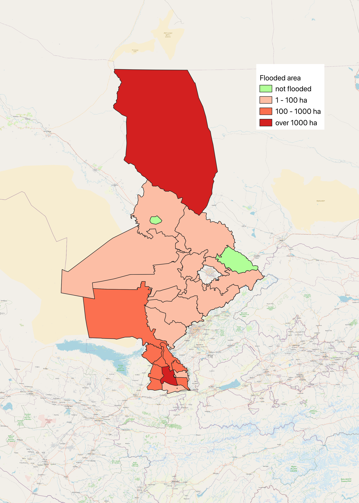

# Ivan Divilkovskiy – Data & Development Portfolio

Welcome to my portfolio of projects in international development, data analysis, and spatial visualization. I combine practical experience in project management and research with technical skills in Python, Stata, QGIS, and GPT-driven automation.

Each folder contains a project where I applied data science and policy analysis techniques to development-related challenges.

## 🌍 Projects

### 1. [UN Peacekeeping Fatalities Visualization](./peacekeeping-fatalities)
An animated geospatial visualization of UN peacekeeping missions and fatalities over time. Combines GPT-assisted data enrichment, Python-based processing and QGIS visualisation.

### 2. [Syrdarya Flood – Dam Collapse Impact Analysis](./Syrdarya_flood)

A spatial and statistical analysis of the May 2020 Sardoba reservoir dam collapse in Uzbekistan and its cross-border flooding into Kazakhstan. Combines GWS and Copernicus data via Google Earth Engine, QGIS, and Python to map inundation extent and assess land-use impacts.

AOI_flooded_area

---

More projects coming soon:

## 📄 CV

You can find my CV here: [Ivan_Divilkovskiy_CV_GitHub.pdf](./Ivan_Divilkovskiy_CV.pdf)

## 📫 Contact

Feel free to reach out on [LinkedIn](https://www.linkedin.com/in/ivandivilkovskiy) or via [email](mailto:ivan.divilkovskiy@gmail.com).
